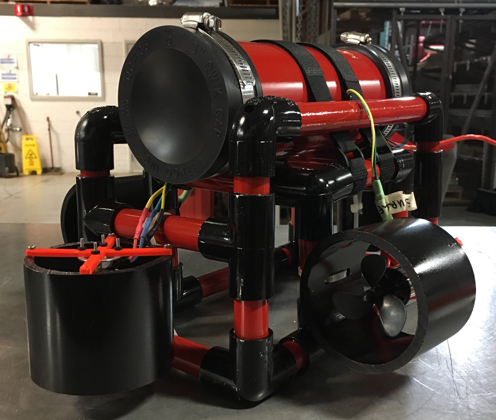

## STEMbot
*STEM outreach/education mini-bot.*

**The Underwater Robotics Team**  
The Ohio State University

* `STEMbot-driver.py`
    * It will tell the STEMbot over socket what forces to apply on each thruster
* `go.py`
    * Runs on the STEMbot's Raspberry pi.
    * It will listen for thrust commands over socket and turn thrusters

[Website](http://go.osu.edu/uwrt) | [Documentation](DOC.md) | [License](LICENSE)
